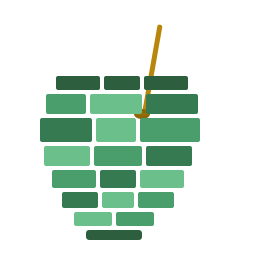

<p align="center">
  
</p>

# Mate

[](https://github.com/muralx/mate/actions/workflows/ci.yml)
[](https://goreportcard.com/report/github.com/muralx/mate)
[](https://pkg.go.dev/github.com/muralx/mate)


A component framework for building terminal UIs in Go, built on top of [Bubble Tea](https://github.com/charmbracelet/bubbletea).

Mate provides a composable component tree with focus management, keyboard and mouse event routing, global key bindings, and popup window support. You build your UI by composing components and setting callbacks — no custom `Update()` or `View()` methods needed.

## Install

```bash
go get github.com/muralx/mate
```

## Quick Example

```go
package main

import (
    "fmt"
    tea "github.com/charmbracelet/bubbletea"
    "github.com/muralx/mate/widget"
    "github.com/muralx/mate/window"
)

func main() {
    win := window.NewWindow("main") // defaults to TCB layout

    panel := widget.NewPanel("panel")
    panel.SetBorder(widget.DefaultBorder())

    nameInput := widget.NewTextInput("name", 30)
    nameInput.WithPlaceholder("Enter your name")
    panel.Add(widget.NewField("field", "Name", nameInput, widget.DefaultFieldStyles()), widget.Next)

    submitBtn := widget.NewButton("submit", "Submit", widget.DefaultButtonStyles())
    submitBtn.OnPress(func() tea.Cmd {
        fmt.Println("Submitted:", nameInput.Value())
        return tea.Quit
    })
    panel.Add(submitBtn, widget.Next)

    win.Add(panel, widget.TCBCenter)

    app := window.NewApp(win)
    tea.NewProgram(app, tea.WithAltScreen(), tea.WithMouseAllMotion()).Run()
}
```

## Features

**Components** — Button, TextInput, Toggle, CheckboxList, TabComponent, Table, ScrollableText, MarkdownTextArea, Card, Text, Field

**Layouts** — Panel supports Vertical (stack top-to-bottom), Horizontal (stack left-to-right), and TCB (Top-Center-Bottom, center flexes to fill space)

**Focus Management** — Tab/Shift-Tab cycling, click-to-focus, ID-based focus, automatic focus restoration after popup close

**Key Bindings** — Global shortcuts registered on any component, resolved by walking the component tree

**Mouse Support** — Hit testing, click-to-focus, click events dispatched to components

**Windows & Popups** — `NewWindow` for the main screen, `NewPopupWindow` for overlays with `Close(result)` / `OnResult` callbacks

**Zero Boilerplate** — No custom `Update()` or `View()`. Compose a tree, set callbacks, done.

## How Mate Relates to Bubble Tea

Bubble Tea follows the [Elm Architecture](https://guide.elm-lang.org/architecture/): you write a Model, an Update function that handles messages, and a View function that renders state. This works well, but as UIs grow complex you end up manually routing events, tracking focus, and wiring up component trees inside Update.

Mate takes a different approach. Instead of writing Update and View functions, you compose a component tree and set callbacks. Mate handles event routing, focus management, and rendering automatically. It uses Bubble Tea as its runtime — terminal I/O, the event loop, and `tea.Cmd` for side effects all work the same way.

| | Bubble Tea (Elm) | Mate |
|---|---|---|
| State | Immutable Model, Update returns new model | Mutable components, methods mutate in place |
| Events | Central Update handles all messages | Routed automatically to focused component |
| Rendering | Pure View function | Components render themselves in a tree |
| Wiring | You write it | Framework handles focus, routing, popups |
| Side effects | `tea.Cmd` | `tea.Cmd` (same) |

You don't need to understand the Elm Architecture to use Mate. If you're coming from Bubble Tea and want to keep writing raw Update/View, Mate might not be for you — it's designed for apps that want a higher-level component model.

## How Mate Compares to Other Go TUI Options

Mate isn't the only choice in this space. Here's an honest take on when each option fits:

| You want | Try |
|---|---|
| The lowest-level building blocks, full control of Update/View, the Bubble Tea ecosystem (Bubbles, Lipgloss) | **[Bubble Tea](https://github.com/charmbracelet/bubbletea)** directly |
| A higher-level component framework built **on Bubble Tea**, with composition and callbacks instead of message routing | **Mate** (you're here) |
| A mature batteries-included TUI library not tied to the Elm Architecture, with a long-established widget set and a different (imperative, event-handler) style | **[tview](https://github.com/rivo/tview)** |
| A minimal, low-level library for absolute terminal control | **[gocui](https://github.com/awesome-gocui/gocui)** |
| Dashboard-style data visualization (gauges, bar charts, sparklines) | **[termui](https://github.com/gizak/termui)** |

Mate sits one layer above Bubble Tea, sharing its ecosystem (Lipgloss styling, Bubbles components like `textinput`, the `tea.Cmd` side-effects model). If you like Bubble Tea but find the message routing repetitive in larger apps, Mate is built for that. If you want a TUI library without the Elm Architecture at all, tview is the more established choice.

## Architecture

```
┌─────────────────────────────────────────────┐
│               App (tea.Model)                │  window/
│  ┌────────────────────────────────────────┐  │
│  │      MainWindow (TCB layout)           │  │
│  │  ┌──────────────────────────────────┐  │  │
│  │  │  Panel (TCBCenter: content)      │  │  │  widget/
│  │  │  ┌────────────────────────────┐  │  │  │
│  │  │  │  Field: Label + TextInput  │  │  │  │
│  │  │  ├────────────────────────────┤  │  │  │
│  │  │  │  Button "Submit"           │  │  │  │
│  │  │  └────────────────────────────┘  │  │  │
│  │  └──────────────────────────────────┘  │  │
│  └────────────────────────────────────────┘  │
│                FocusManager                   │  input/
└─────────────────────────────────────────────┘
```

Four packages:

- **`widget/`** — Components, containers, layouts, and the `Component` interface
- **`input/`** — Focus management and key binding resolution
- **`window/`** — Windows, popups, and the Bubble Tea adapter
- **`markdown/`** — Standalone markdown→ANSI renderer used by `MarkdownTextArea`

## Documentation

Full documentation is in the [`docs/`](docs/) directory:

- [Getting Started](docs/getting-started.md)
- [Components](docs/components.md)
- [Layout](docs/layout.md)
- [Focus and Keyboard](docs/focus-and-keyboard.md)
- [Mouse](docs/mouse.md)
- [Windows and Popups](docs/windows-and-popups.md)
- [Styling](docs/styling.md)
- [API Reference](docs/api-reference.md)

## License

[MIT](LICENSE)
